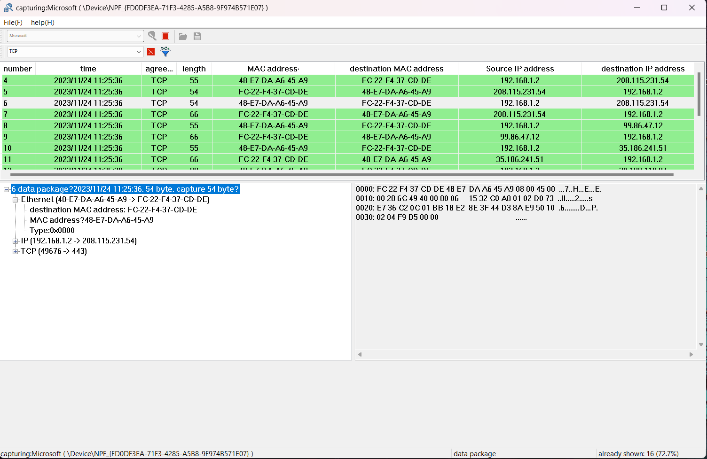

  
  <h1>Kendo - Network Packet Capture and Protocol Analysis Software</h1>

   
  <b>Download:</b> Kendo (Link to be provided)

Kendo is a powerful network packet capture and protocol analysis software developed using the MFC (Microsoft Foundation Classes) and WinPcap library. This tool allows users to capture local network traffic, analyze protocols in real-time, and perform offline protocol analysis by reading pcap files.

  <h2>Development Environment</h2>
<li><b>IDE:</b> Visual Studio 2022</li>
<li><b>Dependency:</b> WinPcap</li>

  <h2>Technical Details</h2>
  <li><b>Front-end Interface:</b> The front-end interface of the Network Packet Analyzer application has been meticulously developed using the Microsoft Foundation Classes (MFC) to ensure a robust and user-friendly experience. MFC provides a framework for building graphical user interfaces and facilitates the creation of responsive and intuitive interfaces for seamless user interaction.</li>
   
  

    

  <li><b>Packet Capture and Storage:</b> The application employs WinPcap, a popular library for packet capture on Windows platforms, to implement local network interface packet capture. WinPcap allows the application to capture raw network data packets, providing a comprehensive view of the network traffic. The captured packets are efficiently stored in pcap (Packet Capture) files, a standard format for storing network packet data, ensuring data integrity and ease of analysis.</li>
  <li><b>Packet Management:</b> Efficient in-memory packet management is achieved through the utilization of the Standard Template Library's (STL) map container. The map container allows for quick and organized storage of packets, enabling fast retrieval and manipulation of packet data. This choice of data structure enhances the overall performance of the application, especially when dealing with a large volume of captured packets.</li>
  <li><b>Inter-thread Communication: </b>To facilitate seamless communication between different threads within the application, an effective inter-thread communication mechanism is implemented. The application utilizes Windows message queues to enable communication between threads. Specifically, the packet capture thread communicates with the window thread, notifying it to parse and print data packets. Additionally, the packet capture thread signals the end of packet capture to prompt the window thread to release allocated resources, ensuring efficient memory management.</li>
  <li><b>Network Protocol Parsers: </b>The Network Packet Analyzer boasts a comprehensive set of network protocol parsers, with a total of 9 parsers written from scratch. These parsers are designed to analyze and interpret various network protocols, providing insights into the structure and content of different types of network traffic. The development of custom parsers demonstrates the application's versatility in handling diverse network protocols, making it a powerful tool for network analysis and troubleshooting.</li>

<h2>Functionality Overview</h2>
The system is designed to offer comprehensive functionality for real-time capture and online protocol analysis, as well as offline protocol analysis through stored pcap files. It provides a robust platform for monitoring and scrutinizing data packets on the local network interface, offering various features to enhance the analysis process.
 
 
<dl><b>1.  Real-time Capture and Online Protocol Analysis:</b></dl>
<ul><li><b>Live Packet Capture:</b> The system captures data packets in real-time from the local network interface, allowing users to monitor ongoing network activities.</li></ul>
<ul><li><b>Online Protocol Analysis: </b>Analyzes the captured data packets on the fly, providing immediate insights into the current network protocols and activities.</li></ul>
 

<dl><b>2.  Pcap File Storage:</b></dl>
<ul><li><b>File Management: </b> The system includes a storage module for pcap files, facilitating the organized storage of captured data for future reference and analysis.</li></ul>
<ul><li><b>Archiving: </b>Users can archive pcap files for historical purposes or compliance requirements.</li></ul>
 

<dl><b>3.  Offline Protocol Analysis:</b></dl>
<ul><li><b>File Reading Capability: </b>The system supports reading stored pcap files, enabling users to conduct protocol analysis on historical network data.</li></ul>
<ul><li><b>Historical Insights: </b>Users can gain insights into past network behavior and diagnose issues retrospectively.</li></ul>
 

<dl><b>4.  Display Filters:</b></dl>
<ul><li><b>Selective Packet Analysis: </b> Offers display filters that allow users to selectively choose data packets based on specified protocols.</li></ul>
<ul><li><b>Customization: </b>Users can define filters to focus on specific protocols, streamlining the analysis process.</li></ul>
 

<dl><b>5.  Common Network Protocol Analysis:</b></dl>
<ul><li><b>Application Layer: </b>DNS, HTTP, DHCP</li></ul>
<ul><li><b>Transport Layer: </b>UDP, TCP</li></ul>
<ul><li><b>Network Layer: </b>IPv4, ICMP</li></ul>
<ul><li><b>Data Link Layer: </b>Ethernet, ARP</li></ul>

 

| ICMP Message Type | ICMP Message Type Value | Support Parsing |
  | ------------------ | ----------------------- | --------------- |
  | Destination Unreachable | 3 | √ |
  | Source Suppression | 4 | √ |
  | Redirect | 5 | √ |
  | Timeout | 11 | √ |
  | Echo Request | 8 | √ |
  | Echo Response | 0 | √ |

   

  | DNS Resource Record Type | Function | Support Resolution |
  | ------------------------ | -------- | ------------------- |
  | A | Query IP Address Based on Domain Name | √ |
  | NS | Specify DNS Server to Resolve Domain Name | √ |
  | CNAME | Query Alias of Domain Name | √ |
  | PTR | Query Domain Name Based on IP Address | √ |

   

  | DHCP Message Option | DHCP Message Option Code | Support Parsing |
  | -------------------- | ------------------------ | --------------- |
  | Fill | 0 | √ |
  | Subnet Mask | 1 | √ |
  | Gateway Address | 3 | √ |
  | DNS Server Address | 6 | √ |
  | Domain Name | 12 | √ |
  | Request IP Address | 50 | √ |
  | IP Address Lease Time | 51 | √ |
  | DHCP Message Type | 53 | √ |
  | DHCP Server ID | 54 | √ |
  | Manufacturer's Logo | 60 | √ |
  | Client ID | 61 | √ |
  | End | 255 | √ |

   

<dl><b>6.  Support Shortcut Keys:</b></dl>

  | Shortcut Keys | Functions |
  | ------------- | --------- |
  | Ctrl + G | Position the cursor to the currently selected packet |
  | Ctrl + O | Open pcap file |
  | Ctrl + W | Close pcap file |
  | Ctrl + S | Save as new pcap file |
  | Alt + F4 | Exit program |

<h2>Language</h2>
 
This project is built using the C++ programming language, ensuring efficiency and high-performance capabilities in network packet capture and analysis.

<h2>Licence</h2>

Kendo, developed under the GNU GPLv2 license, operates with certain licensing provisions. To ensure clarity, please refer to the full text of the license found in the COPYING file, as it is the legally binding document. The following notes are intended to aid those unfamiliar with the GPLv2.

1. **Usage Restrictions:**
   - There are no restrictions on the use of Kendo.
   - Restrictions apply to the distribution of Kendo in both source and binary forms.

2. **License Coverage:**
   - Most components of Kendo are licensed under "GPL version 2 or later."
   - Some files may be subject to different licenses compatible with the GPLv2.

3. **Special Cases:**
   - Certain utilities within the Kendo source have distinct licenses:
     - The WinPcap utility is licensed under the GPLv3+.
   - Despite these exceptions, only the tools themselves are subject to these licenses, and the output of the tools is not considered a derived work. Thus, the output can be safely licensed for Kendo's use.

4. **Library Distribution:**
   - Parts of Kendo may be built and distributed as libraries.
   - These library components remain under the GPL and are not subject to the Lesser General Public License or any other license.

5. **Integration into Applications:**
   - If you integrate all or part of Kendo into your own application, the application must be released under a license compatible with the GPL.

By adhering to these licensing terms, users and developers ensure compliance with the GNU GPLv2 license governing Kendo. It is advisable to consult the full license text for authoritative information on the legal aspects of Kendo's distribution and usage.

<h2>Disclaimer:</h2>

This product comes with no warranties, either expressed or implied. Users are advised to utilize the product at their own risk.

For inquiries or communication with the Kendo Team, please contact us at kendojitsu.katana@gmail.com.
